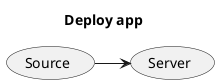
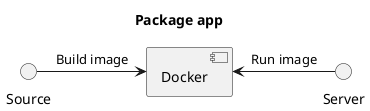
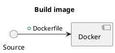
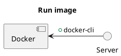
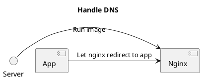

# Deploy app with docker

## Follow





```sh
Package with docker?
Problems resolved:
- Different language (node, php, go,...)
- Different deploy process (yarn serve, yarn start, rails server,... )
```



```sh
Pros:
- Just write down manual steps
```



```sh
Pros:
- Deploy with single cmd: `docker run [IMAGE]`
```

## Demo guide

Build image

```sh
REPO=hoanganh25991
docker build --tag $REPO/todo-app:v0.1 .
docker push $REPO/todo-app:v0.1
```

Run image

```sh
./setup/install-docker.sh
```

```sh
docker run --rm --detach \
  --publish 3000:80 \
  hoanganh25991/todo-app:v0.1
```

## Nginx Reverse



Setup nginx

```sh
cd docker-nginx-reverse-proxy
docker-compose up
```

Run app

```sh
DOMAIN_NAME=todo-app.SERVER_IP.nip.io
docker run --rm --detach \
  --network nginx \
  --env VIRTUAL_HOST=$DOMAIN_NAME \
  --env LETSENCRYPT_HOST=$DOMAIN_NAME \
  --env LETSENCRYPT_EMAIL=admin@example.com \
  hoanganh25991/todo-app:v0.1
```
