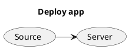
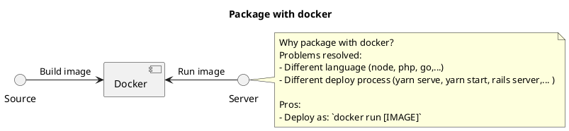
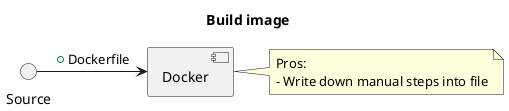
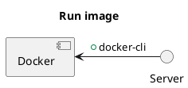
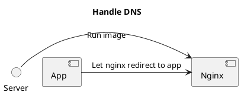

# Deploy app with docker

## Follow









## Demo guide

Build image

```sh
# DOCKER_USER=hoanganh25991
docker build --tag hoanganh25991/todo-app:v0.1 .
docker push hoanganh25991/todo-app:v0.1
```

Run image

```sh
./setup/install-docker.sh
```

```sh
docker run --rm --detach \
  --publish 3000:80 \
  hoanganh25991/todo-app:v0.1
```

## Nginx Reverse



Setup nginx

```sh
cd docker-nginx-reverse-proxy
docker-compose up
```

Run app

```sh
DOMAIN_NAME=todo-app.SERVER_IP.nip.io
docker run --rm --detach \
  --network nginx \
  --env VIRTUAL_HOST=$DOMAIN_NAME \
  --env LETSENCRYPT_HOST=$DOMAIN_NAME \
  --env LETSENCRYPT_EMAIL=admin@example.com \
  hoanganh25991/todo-app:v0.1
```
